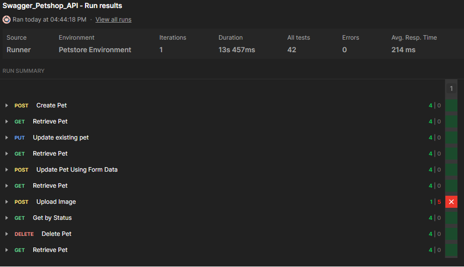
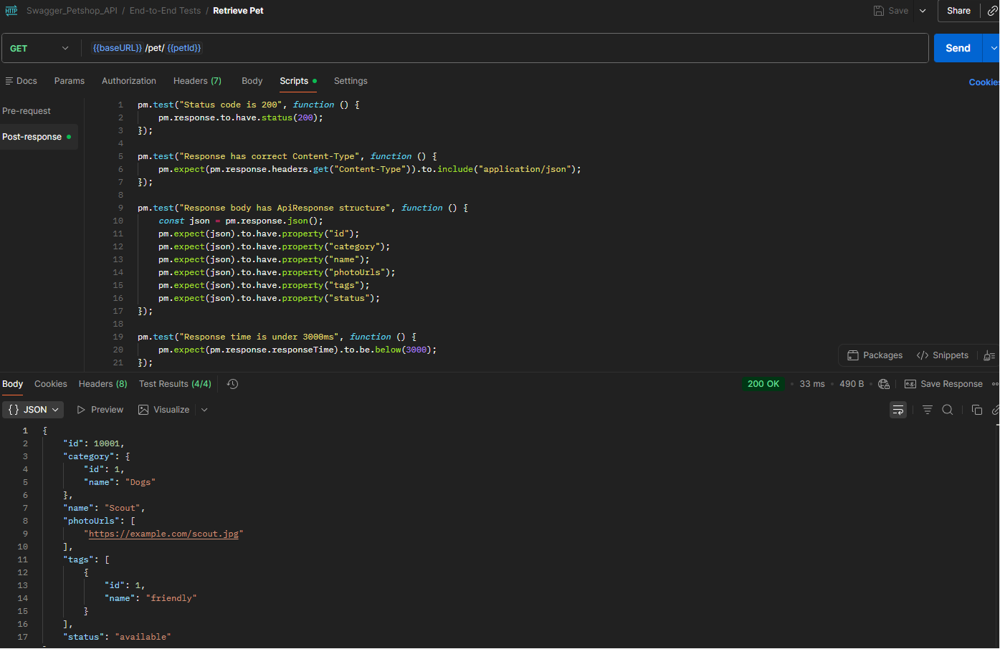
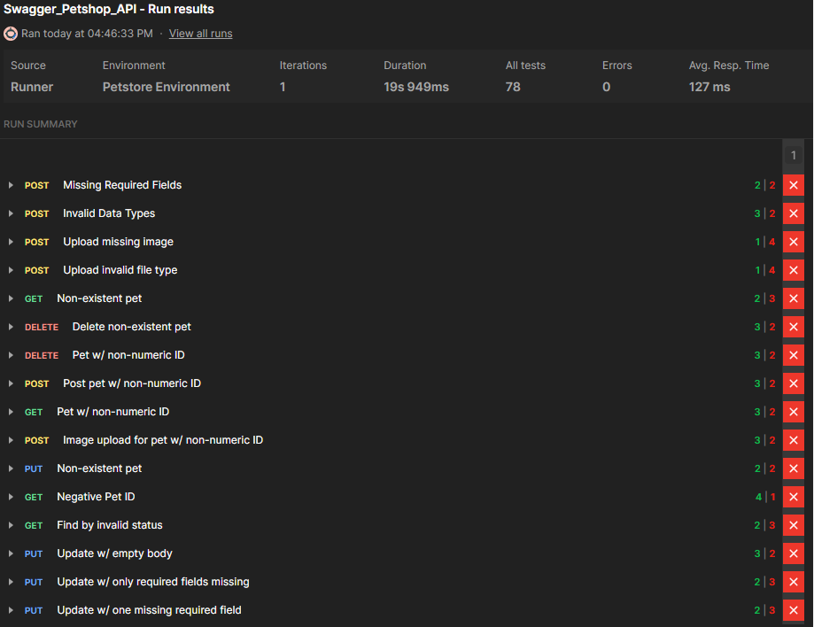
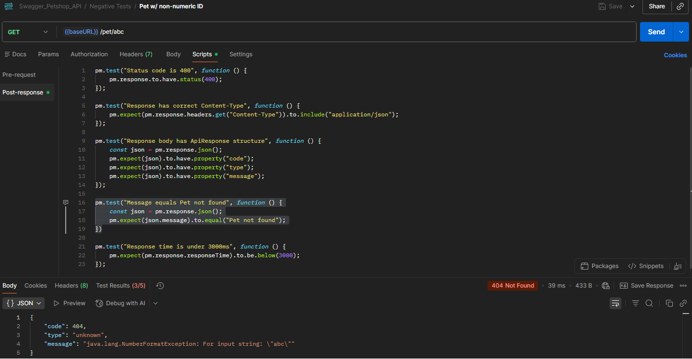

# API Testing Project

## Project Overview

This project demonstrates API testing practices performed on the [Swagger Petstore API](https://petstore.swagger.io/v2) using structured test case design, request execution, and defect reporting.

## Scope

The testing focused on:

- Pet creation and retrieval
- Pet updates via JSON and form data
- Image uploads
- Pet deletion
- Status-based search

## Testing Types Performed

- Functional Testing
- Positive Testing
- Negative Testing
- Edge Case Testing

## Tools Used

- Postman
- Google Sheets

## Included Artifacts

- Postman Collection
- Postman Environment
- Test Cases
- Bug Reports

## Key Skills Demonstrated

- API test case design and documentation
- Multi-content-type testing (JSON, form-data, multipart)
- Postman test scripting
- Bug identification and formal reporting
- Pattern recognition across a test suite
- Test environment management

## Postman End-To-End Collection Run

## GET /pet Assertions

## Postman Negative Collection Run

## Negative GET /pet Assertions

